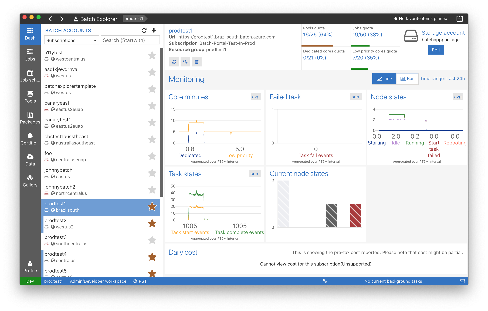
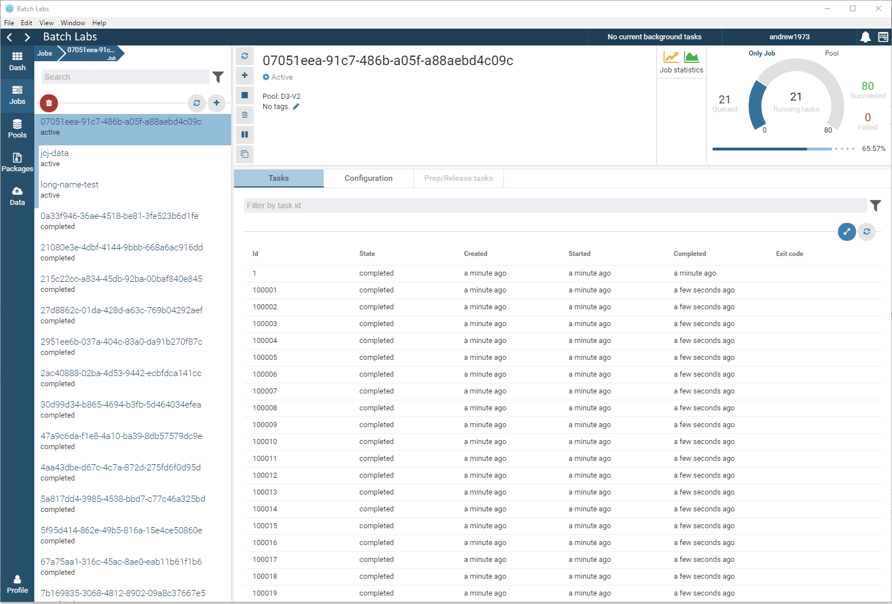

# BatchExplorer

Batch Explorer is a tool to manage your Azure Batch accounts. The goal is to implement a great user experience that will help you debug, monitor and manage your pools, jobs and tasks.
It will also include experimental features such as `Batch Templates` in the aim to improve your Batch experience. We are open to any feedback, ideas and contributions you might have.

## Downloads

You can download the latest version at <https://github.com/Azure/BatchExplorer/releases>

To build Batch Explorer yourself see this [wiki](https://github.com/Azure/BatchExplorer/wiki)

## Feedback

* Request a new feature on [GitHub](https://github.com/Azure/BatchExplorer/issues)
* Vote for popular [feature requests](https://github.com/Azure/BatchExplorer/issues?utf8=%E2%9C%93&q=is%3Aopen+is%3Aissue+label%3Afeature+sort%3Areactions-%2B1-desc+)
* File a bug on [GitHub](https://github.com/Azure/BatchExplorer/issues)

## Developers

[Dev docs](docs/readme.md)

## Data/Telemetry

Batch Explorer collects usage data and sends it to Microsoft to help improve our products and services. Read Microsoft's [privacy statement to learn more.](https://privacy.microsoft.com/en-us/privacystatement)

Please go see [How to disable crash reporting and telemetry](https://github.com/Azure/BatchExplorer/wiki/Crash-reporting-and-telemetry#how-to-disable-crash-reporting-and-telemetry) to disable it.

## License

Copyright (c) Microsoft Corporation. All rights reserved.

Batch Explorer is licensed under MIT [See license](LICENSE)

Some icons are under Creative Commons Attribution-ShareAlike 3.0 Unported [See license](app/assets/images/logos/LICENSE)
