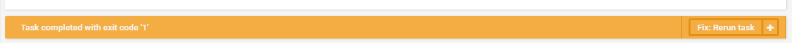
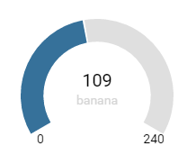

# Core controls

## Banner

Banner is a box used to notifiy the user something is wrong with their app. It provide some quick fix functionalities



Example for the image above

```html
<bl-banner fixMessage="Rerun task" [fix]="rerun" type="warning">
    <div [other-fix]="rerunDifferent" fixMessage="Rerun with different attributes"></div>
    <div message>{{exitCodeMessage}}</div>
</bl-banner>
```

```typescript
export class MyComponent {

    @autobind()
    public rerun() {
        return of(true); // Do your quickfix here
    }

    @autobind()
    public rerunDifferent() {
        return of(true); // Do your quickfix here
    }
}
```

## Gauge

Gauge is a custom graphical representation that can show a min, max and a value.



Example for the image above

```html
<bl-gauge [value]=[109] options="gaugeOptions" size="small">
</bl-gauge>
```

```typescript
export class MyComponent {
    public gaugeOptions = {
        min: 0,
        max: 240,
    }
}
```

| Attr    | Description                                                                                                                  |
|---------|------------------------------------------------------------------------------------------------------------------------------|
| size    | Size can be one of the presets `xsmall` `small` `medium` `large` or any number.                                              |
| value   | value of the gauge                                                                                                           |
| options | Options for the gauge. See `gauge-config.ts`                                                                                 |
