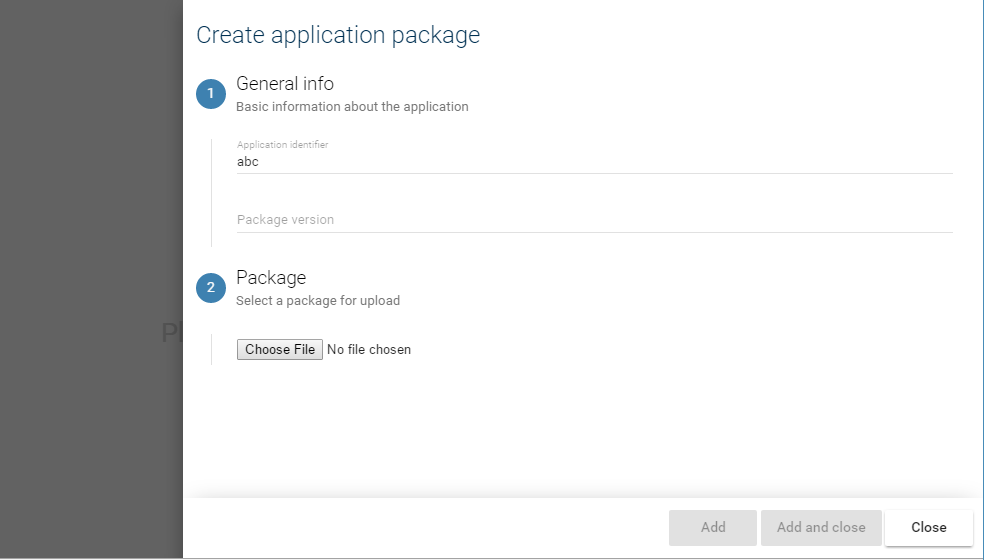

# Write forms

## Complex form



You first need to use the `bl-complex-form` component. You will need to pass the formGroup as an input and the submit method(Don't forget to autobind the submit)

```html
<bl-complex-form [formGroup]="form" [submit]="submit" [containerRef]="sidebarRef">
    ...
</bl-complex-form>
```

Now each forms is composed of multiple pages. The first page defined will be the first to be displayed. You can then later call otherPage.activate() to switch to a new page.

```html
<bl-complex-form [formGroup]="form" [submit]="submit" [containerRef]="sidebarRef">
    <bl-form-page title="This form is for adding a new entity" [formGroup]="form">

    </bl-form-page>

    <bl-form-page title="Sub page" [formGroup]="form" #subPage>

    </bl-form-page>
</bl-complex-form>
```

Each page is composed of multiple section(If only have 1 section do not provide the name and it will not show the title and left bar)

```html
<bl-complex-form [formGroup]="form" [submit]="submit" [containerRef]="sidebarRef">
    <bl-form-page title="This form is for adding a new entity" [formGroup]="form">
        <!-- This section will have the #1 next to it -->
        <bl-form-section title="General" subtitle="Main info">
            <input formControlName="mainInput1"></input>
            <input formControlName="mainInput2"></input>
        </bl-form-section>

        <!-- This section will have the #2 next to it -->
        <bl-form-section title="Secondary" subtitle="Secondary info">
            <input formControlName="secondInput"></input>
        </bl-form-section>
    </bl-form-page>

    <bl-form-page title="Sub page" [formGroup]="form" #subPage>
        <!-- Simple section with no title-->
        <bl-form-section>
            <input formControlName="myOtherInput"></input>
        </bl-form-section>
    </bl-form-page>
</bl-complex-form>
```

## Multi Picker

For complex forms that needs to add multiple complex items the form picker might suit the needs.


Attributes:

* `addTitle`: This is text that will be displayed on the button to add a new element
* `max`: This is the maximum number of items to allow. By default it is unlimited(Value -1)

```html
<bl-form-multi-picker formControlName="userAccounts" #userAccountsPicker addTitle="Add a user account" [max]="5">
    <!-- This is the template for selected item. Use the blFormPickerItem directive on it.-->
    <!-- Use let-value to assign the item to the value variable -->
    <ng-template blFormPickerItem let-value>
        <div title>
            {{value?.name}}
        </div>
        <div subtitle class="unaccent">
            {{value?.runElevated ? "Administrator": ""}}
        </div>
    </ng-template>

    <!-- This is the nested form template -->
    <!-- User the currentEditValue to get the edit formControl -->
    <div nested-form>
        <bl-user-account-picker [formControl]="userAccountsPicker.currentEditValue"></bl-user-account-picker>
    </div>
</bl-form-multi-picker>
```
