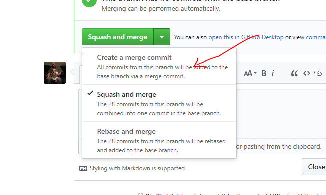

# New release

There is 2 types of releases:

* **Major releases**: This is for a release that contains new features
* **Hot fix releases**: This should **ONLY** be for patching major bugs that prevent usage

## Major release process

This is the steps to create a major release

### Prerequistie: Millestone

Every release should have a millestone with the list of issues fixed in that new version.

You can use the command `yarn publish -- <millestoneid>` to do step 1&2 and skip to step 3

### Step 1: Create a release issue

Create a new issue in the millestone with the title `Prepare version x.y.z` and the following description:

```md
- [ ] Update version in package.json
- [ ] Update changelog
- [ ] Update third party notices if needed
- [ ] Double check the prod build is working
```

This will help with tracking the required task for a new release.

### Step 2: Update repo

Create a branch called `release/prepare-<milestone>`, i.e. `release/prepare-0.10.0`

#### Update version in package.json

This is quite straightforward. Just change the following line to have the version wanted

```json
{
    ...
    "version": "0.2.0",
    ...
}
```

#### Update the changelog

This is a bit more tedious as it require looking at the millestone completed and writing a reable changelog for the user of Batch Explorer.
This should be targeted at user and not developper which means there is no need to include internal issues and refactoring work.
Describe what functionality changed in the app with a link to the issue.

Example:

```md
* Added this awesome thing in the pool details [\#123](https://github.com/Azure/BatchExplorer/issues/123)
```

**Note:** There is now a utility to generate the change log for a millestone also so you don't have to write it manually.
[https://www.npmjs.com/package/github-changelog-gen](https://www.npmjs.com/package/github-changelog-gen)

#### Update third party notices

Running the following command will update any required third party notices.

```shell
yarn ts scripts/lca/generate-third-party
```

**Important:** Make sure you have an environment variable called GH_TOKEN set that contains a valid GitHub API auth token.
You can manage and setup personal access tokens here: [https://github.com/settings/tokens](https://github.com/settings/tokens)

If you see an error like the following while executing the 'generate-third-party' script:

```shell
const value = match[1];
                    ^
TypeError: Cannot read property '1' of null
```

This probably means that a dependancy in package.json has a differnt format to what we are expecting.
You will need to modify '\scripts\lca\generate-third-party.ts' in order to get it to work.

#### Double check the prod build is working

Travis should check on master that the build itself it not failing. However there could still be runtime errors that happens.
Do the following and test the application.

```shell
yarn build:package
```

### Step: 3 Merge those changes

Create a PR against master with the changelog, package.json changes and reference the issue created in step 1(.i.e fix \#123).

### Step 4: Create a PR against stable

Now create a pull request against stable. Wait for the CI to pass.

**Important:** DO NOT squash merge the changes.(Go in BatchExplorer [settings](https://github.com/Azure/BatchExplorer/settings) and renenable "Allow merge commits")
Then click on merge commit(Make sure it is not squash merge)



All the commits in master should now be in stable with the merge commit.
Now disable the "Allow merge commit" again to prevent mistake when merging to master.

## Hot fix release

For a hot fix release you'll want to create a PR with your fix directly against `stable`.
In your changes include the bump of the patch in the version if needs be(Only increase once if you have multiple hot fixes in different PR)
Update `Changelog.md` with the list of the fixes.

When ready squash merge your PR in stable.

## Deploy the release

Check the wiki in msazure VSTS <https://msazure.visualstudio.com/AzureBatch/_wiki/wikis/AzureBatch.wiki?wikiVersion=GBwikiMaster&pagePath=%2FBatch%20Explorer%2FDeploy%20new%20version%20of%20Batch%20Explorer>
