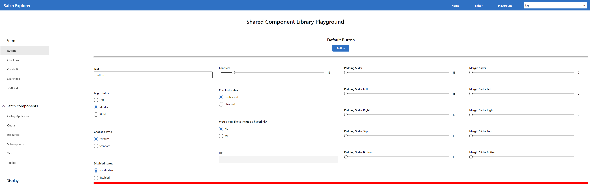
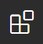
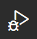
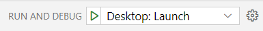
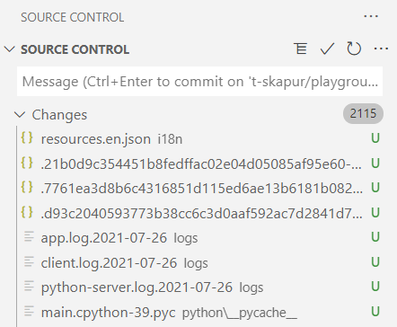
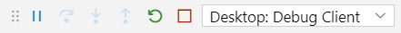
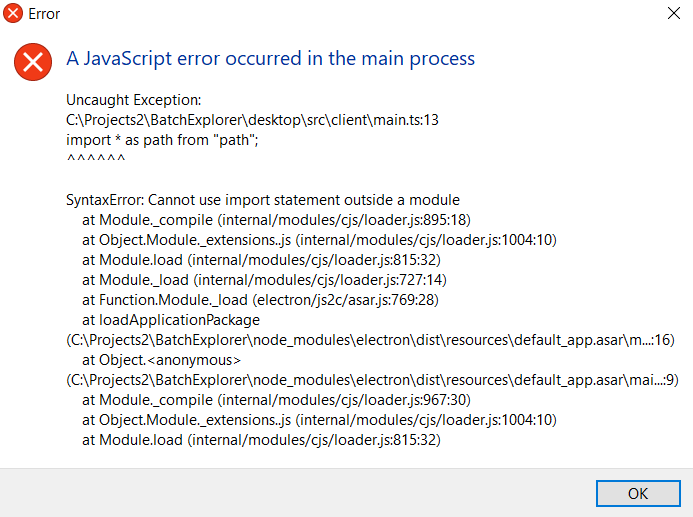

# Playground

The Shared Component Library playground refers to a UI component “playground” for developing/testing shared components between Batch Explorer and the Batch portal extension. Like the Fluent UI “Controls” page or the Azure Portal Playground, this provides the ability to render controls with various options selected, using different themes, etc.

The playground can be rendered in 2 different formats: a standalone web version, and in the Batch Explorer desktop application.

## General Setup (needed for either version)

1. Follow the steps here to install/build BatchExplorer: [Build Batch Explorer](https://github.com/Azure/BatchExplorer/wiki/Build-batch-explorer-yourself)
2. In Batch Explorer, checkout the t-skapur/playground branch. (Run `git checkout t-skapur/playground`.)
3. Open VSCode and navigate to the **Extensions** blade by clicking this icon or pressing Ctrl+Shift+X: 
4. Install the following extensions in VSCode:
   - EditorConfig for VSCode
   - ESLint
   - GitLens — Git supercharged
   - Live Share
   - markdownlint
   - Prettier - Code formatter
   - Prettier ESLint
   - stylelint

## Rendering Version #1: Standalone Web Version

1. Open BatchExplorer in VSCode.
2. Run `yarn install` to install any dependencies.
3. Run `yarn build:web` to build the web version of the project.
4. Run `yarn start:web` to get the web version running on your local machine.
   - Check the console messages for **"Project is running at …"** to see the URL at which the project is running. [It is usually [at port 9000](http://127.0.0.1:9000/)]

## Rendering Version #2: BatchExplorer Desktop Integration

1. Open BatchExplorer in VSCode.
2. If running the desktop version for the first time: in the desktop folder inside BatchExplorer, run `yarn install` and then `yarn build`.
3. In VSCode, click the **Run and Debug** icon on the left-hand side or press Ctrl+Shift+D to get to that icon: 
4. Next to **Run and Debug** at the top left of VSCode, select **Desktop: Launch** and click the green start button.  
5. Enter authentication credentials into the dev version of BatchExplorer that pops up.
6. Click the **Profile** button in the left column of the BatchExplorer and select **Playground** from the menu.

- To change the playground’s theme: click **Profile** again, select **Settings**, choose a new theme, and go back to the **Playground** tab.

## Troubleshooting

### General

- You can use Ctrl+C to quit out of any terminal operation at any time.

- When you switch branches, you may see thousands of untracked files in the source control, like this:  
    - **Fix:** Hover over the word **Changes** and select the **Discard All Changes** icon, then proceed to the next steps.

### Running the Desktop App

- You can stop the application by pressing the red square in the Desktop client: 

- If you stop the app and then start it up again, you may get an error -> **Error: listen EADDRINUSE: address already in use.**
    - **Fix:** In the terminal, in any directory, run: “Get-Process "node" | Stop-Process"

- You may encounter a **SyntaxError: Cannot use import statement outside a module.**  
    - **Fix:** Navigate to the desktop folder in BatchExplorer, run `yarn install` and then `yarn build`, and then run the application again.
